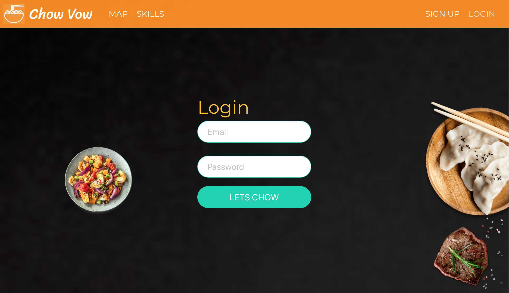
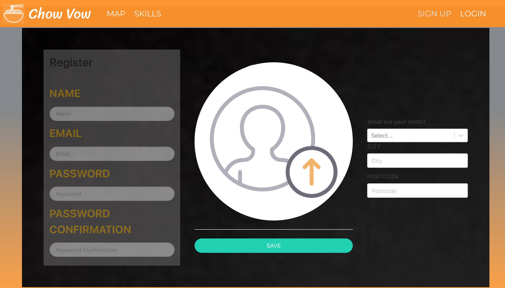
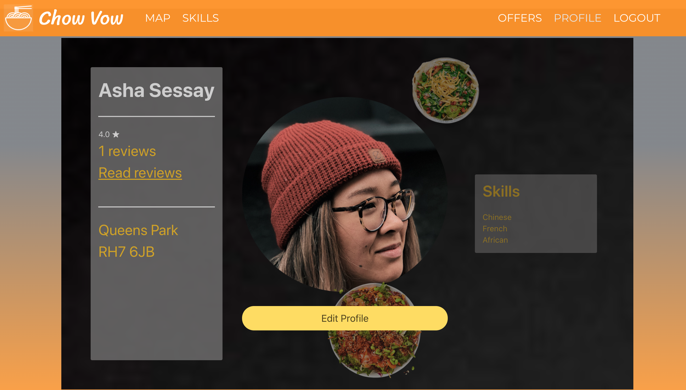
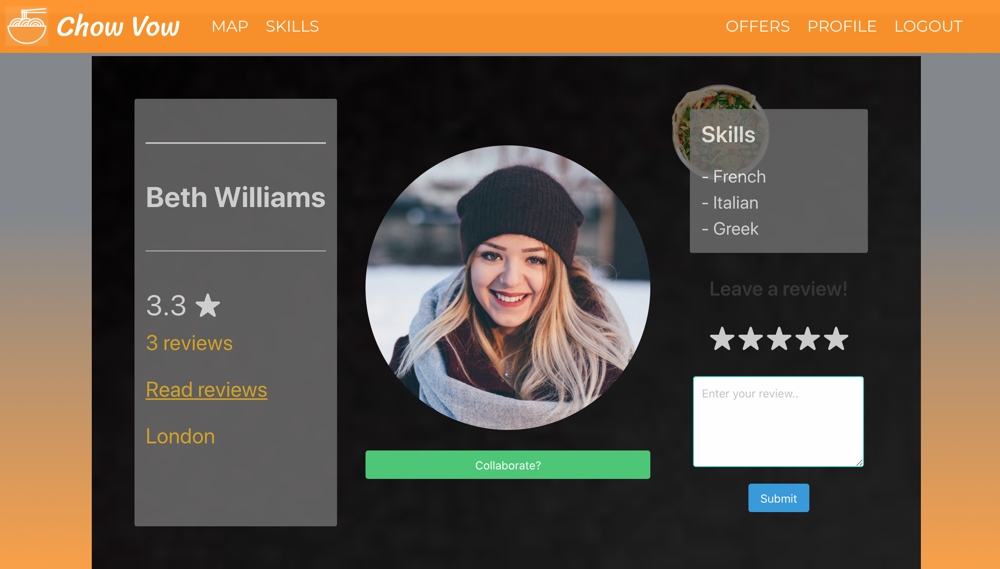
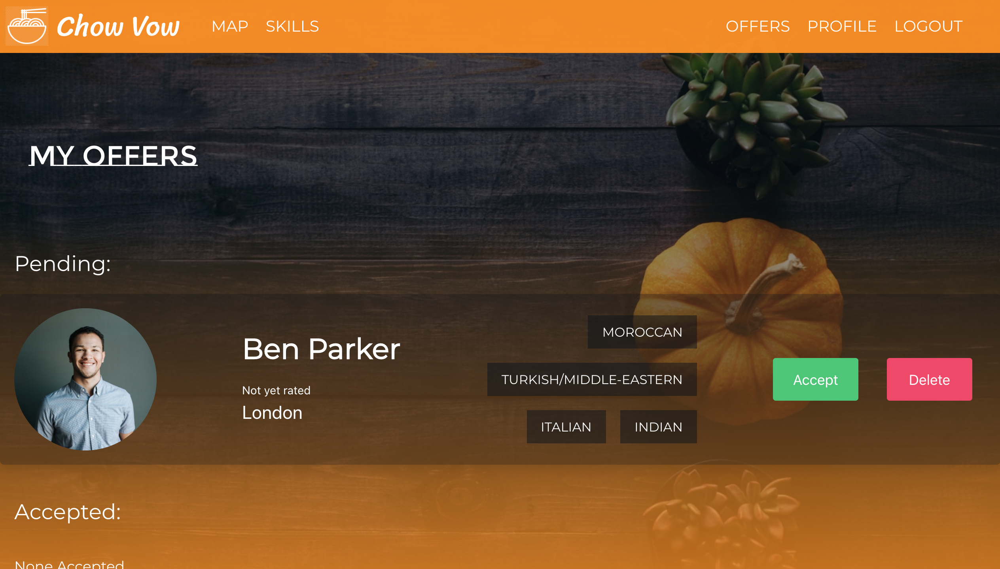
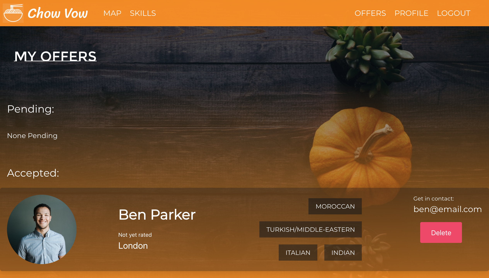
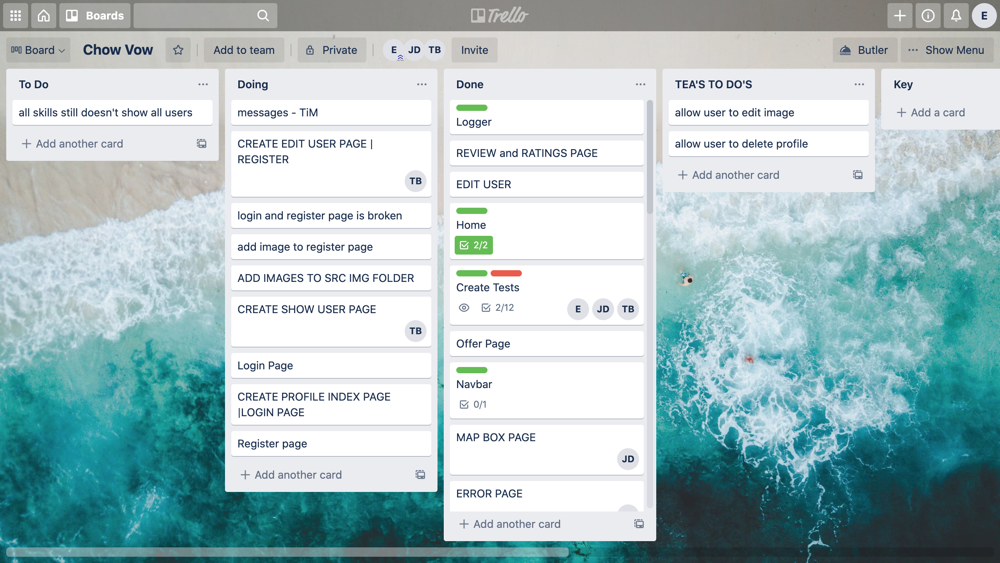

# Software Engineering Immersive: Project 3 (Group Project)

This is a group project I built in collaboration with three other classmates during the General Assembly Software Engineering Immersive course (Week 9).

## Team Mates
- Tim Banks: https://github.com/Tbanks9
- James Darby: https://github.com/Darbjm
- Tahirah A'sha: https://github.com/justteaco

---

# Chow Vow

Chow Vow is a MERN stack app aimed at those wanting to connect with others based on a shared love of cooking and to share culinary skills. 

## Built With

1. HTML5
2. SCSS & Bulma
3. JavaScript
   * ECMAScript6
   * React.js
   * Node.js
   * Express.js
   * Axios
4. MongoDB
5. Testing
   * Manual: Insomnia
   * Automated: Mocha & Chai
5. GitHub

## Deployment

This app is deployed on Heroku and can be found here: https://chow-vow.herokuapp.com/

## Getting Started

Use the clone button to download the source code. In the terminal, enter the following commands:

To install all the packages listed in the package.json:
```
$ yarn
```
Run the app on your localhost:
```
$ yarn start
```
Check the console for any issues, and if there are any, check the package.json for any dependencies missing.

## User Experience

### Login & Register

When the user lands on the website they can login using the form, if they don't have an account they can click on the 'Sign Up' link which redirects them to the register page. 




#
### Profile

Once a user is logged in, they will be taken to their profile page where they can read any reviews they have received, or make any changes to their profile if they wish. 



#
### Homepage

Once on the homepage, the search bar can be used to find other users in your area, by entering your location or postcode. This will then redirect users to the map page.


#
### Skills

If the user wishes to browse the skills on offer irrespective of location, they can either scroll down the homepage and use the links to search for users based on their desired skill, or they can click on 'Skills' in the navbar and use the dropdown to select a skill.


#
### Map

A quick and easy way for users to find other users in their area is by searching through the map page, where you are given an approximate location of users nearby. A marker displaying the user's profile image appears on the map and if you click on the image a pop-up appears displaying the user's name and a list of their skills. You can then click on the pop-up to be directed to their profile page.


#
### User page

Once you have navigated to a particular user's profile page, you can view additional information about them, see their average star rating, read reviews from other users or leave your own review.




#
### Offers

If you are interested in exchanging skills with another user, you can simply click on the 'Collaborate' button, which will send an offer to the user. When that user next logs in, the offer will appear under their 'My Offers' tab, where they can choose to accept or delete the request. If the user accepts the offer, it reveals the requestee's email address for them to get in contact and start sharing skills!




## Project Management

As a team, we held an initial planning session to discuss what it was we wanted to build, plus all if the requirements to deliver our MVP. 

1. We spent the first day offline, sharing ideas of what our visions were for the app and planning the structure of our week. We then created a trello board outlining our plan and ensuring the whole team knew what eachother were working on.
2. After deciding on our idea and MVP, we planned our backend requirements and sketched some frontend designs, defining the user journey in the process.
4. As a group we started implementing the backend, creating our models, views and controllers, testing as we built.
5. Within 3 days, our backend was complete which allowed us to start on the frontend.
6. The final few days were spent building the functionaility of the frontend, with the end of the week focussed more on usability and design.



This is an example of our Trello board one day. Each morning we would discuss what we had worked on the day before, as well as any issues that required the group to look into collectively. We would then decide what each of us were working on that day, ensuring there were no overlaps.

## My Contributions

I contributed to the following elements:

Backend:

* User model (User and ratings schemas, average rating virtual schema)
* Auth & User controllers (Profile, Index, Show and Ratings)
* Environment, router and logger setup
* Seeds (divided equally between group)

Frontend:

* Home page
* Skills page (index)
* Profile page
* User page
* Review page
* Contribution to styling (home, skills, offers, reviews)

## Featured Code

--- BACKEND ---

I took the lead on developing the ratings feature, and started with the backend functionality. I created the below controller that allows one user to rate another user:

```js
function ratingCreate(req, res) {
  User
    .findById(req.params.id)
    .then(user => {
      if (!user) return res.status(404).json({ message: 'Not Found ' })
      if (user.equals(req.currentUser._id)) return res.status(401).json({ message: 'Unauthorized' })
      user.rating.push(req.body)
      return user.save()
    })
    .then(user => res.status(201).json(user))
    .catch(err => res.status(404).json(err))
}
```
Below is a virtual schema I built to store the overall average rating of a user. I wrote a function that gathers all the ratings data for a user, adds all ratings together and calculates the average rating to be shown on their profile.

```js
userSchema
  .virtual('avgRating')
  .get(function () {
    const mappedUsers = [...this.rating]
    if (mappedUsers.length) {
      const newMappedUsers = mappedUsers.map(rating => {
        return rating.rating
      })
      const sum = newMappedUsers.reduce((previous, current) => current += previous)
      const avgRating = (sum / newMappedUsers.length).toFixed(1)
      return avgRating
    } else {
      return 0
    }
  })
```

--- FRONTEND ---

One of my frontend tasks was to build the skills page (index) that displays the users associated with the skill selected. The below function gets all of the user data, and either returns a list of all users (if 'All' was selected) or filters the users and returns only those that have the selected skill included in their skill set.

```js
async getData() {
  try {
    const res = await axios.get('/api/chefs')
    let filteredUsers = []
    const skillFilter = localStorage.getItem('skill')
    if (skillFilter === 'ALL') {
      filteredUsers = [...res.data]
    } else {
      res.data.filter(user => {
        if (user.skills.includes(`${skillFilter}`) && user._id !== Auth.getUser()) {
          filteredUsers = [...filteredUsers, user]
        } return res.data
      })
    }
    this.setState({ users: filteredUsers, skillFilter })
  } catch (err) {
    console.log(err)
  }
  }
  ```

## Wins and Key Learnings

- In the initial stages of planning, we knew that we wanted some way for the users to connect with each other. We considered implementing a live chat feature, but because of the timescale we decided to build an offer feature instead. This feature was one of the more complex components and getting it to communicate between different users was a challenge for the whole team. Being able to complete this feature, and have it running smoothy, was a huge win for us as a team.

- When starting the project, I didn't completely understand virtual schemas or how they might be used, but when I began building the ratings feature it soon became apparent that I needed a way to store an overall user rating (calculated from the avergage of all ratings) within the user model. After doing some research, I discovered that a virtual schema would be the perfect tool to store this data. Being able to build this feature successfully and gain a better understanding of virtual schemas was a huge personal win for me.

- Something we all learnt from this project was the importance of thorough planning at the start, and throughout, the project. Sometimes it is tempting to get straight into coding, especially when you are excited about your idea, but taking the time to plan every aspect of the app and allocate time to build each part proved vital to the success of our team.

## Challenges and Future Improvements

- This was my first time using git as a version-control system within a group and we encountered quite a few merge conflicts. We learnt that dealing with these issues could sometimes be time-consuming but could be avoided with proper communication within the group.

- One future improvement would be to implement reviews & ratings on a user basis, as it is currently anonymous as well as allow users to edit and delete their reviews. We would also have liked to have each rating linked to it's corresponding review, which would involve merging the two schemas in the user model.

- Another element that would have been nice to add is a 'Recipes' feature. This would allow users to showcase their favourite recipes on their profile, as well as allow users to exchange recipes with eachother.


